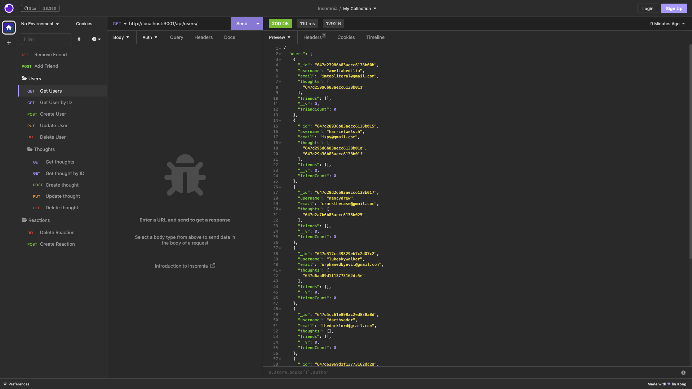
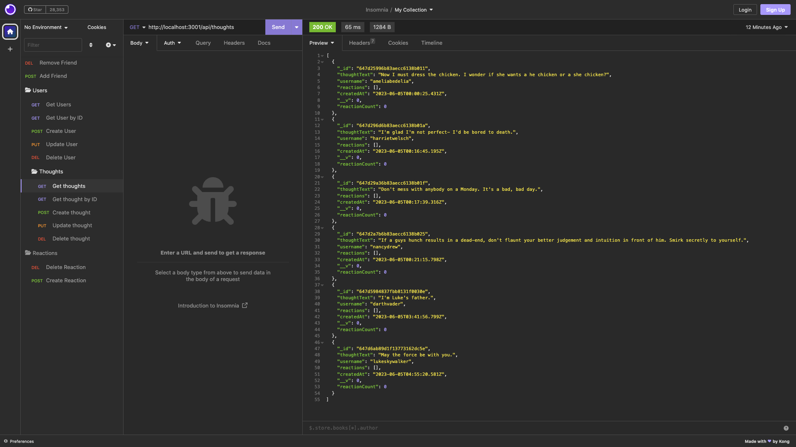
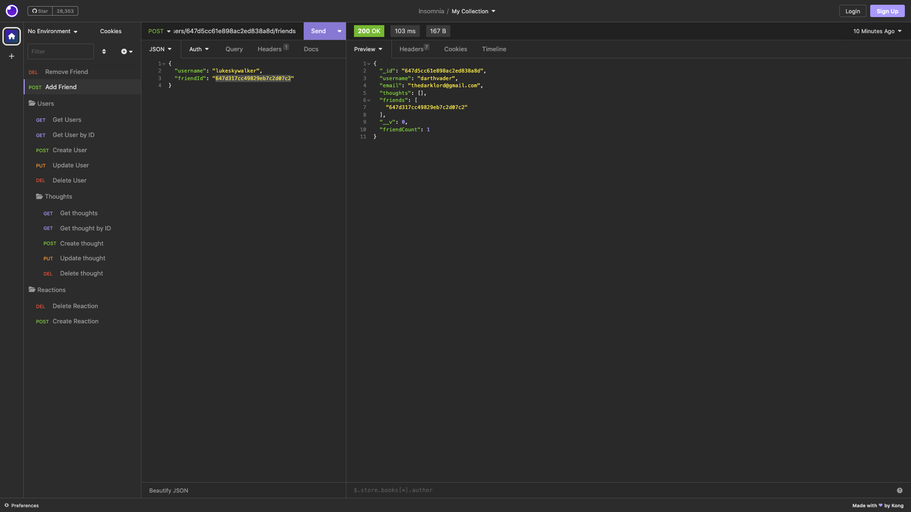
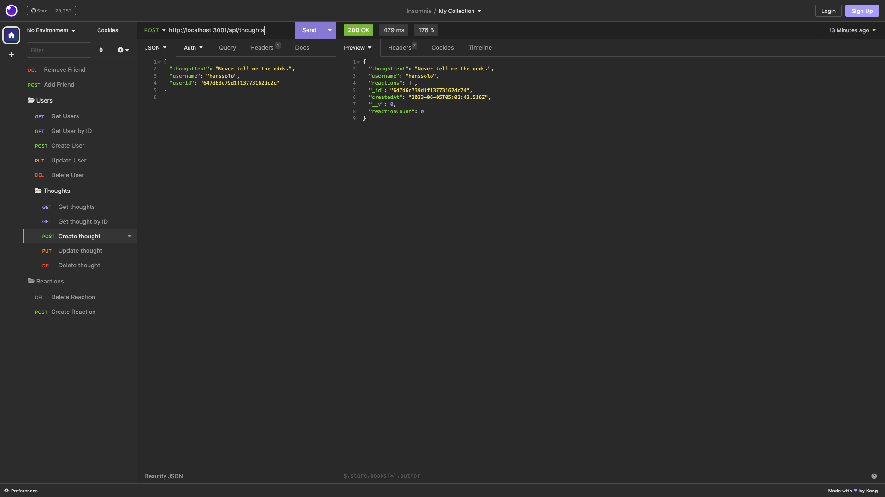

# 10 Thought Share

## Description

Built with the NoSQL database, MongoDB, Thought Share is a robust API capable of managing user profiles, user thoughts and user friend lists. 

Every user has the ability to share their thoughts, which are then linked to their profile through a unique user ID. The backend API provides a route for creating new thoughts, through a post request, where users can submit thoughts that are then saved to the database.

Engagement is the most critical part of any social media experience. Thought Share allows users to connect and respond to their friends' thoughts as a reaction. 

The ability to create, read, update, and delete (CRUD) data in the database forms the core of this application.

## Video Demonstration:

https://drive.google.com/file/d/1WMn2kE79HtSHByNDXEmNn07kRU-D066P/view

## Installation:

This application requires MongoDB to be installed on your machine. After starting your server, and syncing the Mongoose models to the database, you will utilize insomnia to make HTTP requests to your local host. Using a series of GET, POST, PUT and DELETE requests you can manage and update database information.

## Credits:

 - Lama Dev :  https://www.youtube.com/watch?v=ldGl6L4Vktk

## License:

## Contact:

If you would like additional information, please contact Yevette Hunt.
My GitHub username is yveivy

